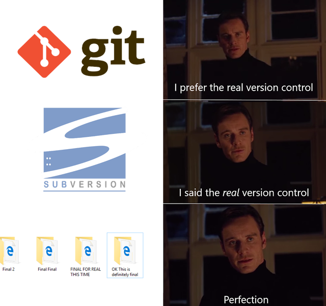

#  SOFTWARE ENGINEERING IMMERSIVE

## Intro to Git

### Lesson Objectives

By the end of this lesson, you will be comfortable with:

- Utilizing git versioning to track changes to your code.
- Initializing a git repository.
- Staging and committing new and changed files in a git repository.
- Removing files from the staging area.

<br>

### Why Git?

Git, at its core, is a _version control system_.

_Version control_ is the systematic process of tracking and storing multiple versions of a single project, allowing developers to merge and update projects in a collaborative (and safe) way.

As developers, our code is our livelihood. It's vital that we backup, edit, and contribute to code in a way that is safe, effective, and efficient.

This means that we need to edit our code in a way that...

- Doesn't break our live app (often referred to as "cowboy coding");
- Enables us to make changes in small, block-sized chunks.
- Tests our changes for unexpected conflicts or bugs;
- Documents our changes clearly and thoroughly, should we need to troubleshoot an update, or in the case of catastrophic mistakes, return to the prior versions; and

<br>

### But... why?

<details><summary>This is why.</summary>



_... sarcasm._

</details>

There are a lot of advantages to version control, but namely:

- It decentralizes your code, making it easy to keep backups.
- It enables collaboration on complex code projects.
- it gives us the freedom to experiment and try new things without messing up the code base.

Let's put this knowledge to use.


***

### Code Along!

#### First, Create A Fresh Repo

- Make a directory, titled `mean-girls`.
- Drop into the mean-girls directory.
- Create a text file that we can version control with git, titled `cady`.

<details><summary>Reveal Commands</summary>

<details><summary>Are you sure? I bet you could recall it from memory.</summary>

<details><summary>Fine. Reveal the answers for real this time.</summary>


1. `mkdir mean-girls`
2. `cd mean-girls`
3. `touch cady.txt`

</details>
</details>
</details>

<br>

#### Next, Confirm Your Location

(It's good to get in the habit...)

- Check which files you have in your current directory.
- Check the git status of your repository.

<details><summary>Reveal Commands</summary>

1. `l`
2. `git status`

</details>

<br>

#### Initialize Your Git Repo

Of course, `git status` didn't help– this isn't a git repo yet.

- Initialize a git repo in this folder.
- Check which files are in the current directory again.

<details><summary>Reveal Commands</summary>

1. `git init`
1. `l`

What changed?

</details>

<br>

#### Finally, Let's Control Some Versions

- Add your `cady` file to your git stage.
- Check the git status of your repository again.
- Commit your staged file to your working tree. 

One note about commit messages– clear and concise messages are imperative to collaboration. Follow Git commit message convention by using the present-tense imperative.

<details><summary>Reveal Commands</summary>

1. `git add cady.txt`
2. `git status`
3. `git commit -m "initialize git repo`

</details>

<br>


Git confirms that we've committed 1 file. _What else does it show in the message?_

<br> 

***

### Staging & Committing

Once you make any change to a repo that's initialized and committed, the changed files can be in one of 3 stages:

1. `modified` means that you have changed the file in your working directory- but that's all.
1. `staged` means that you have _added_ a modified file– in its current version–
to be committed in your next commit.
1. `committed` means that the data is committed _to the working tree_ in your local repository.

Visually, it looks like this:


<br>

***

### Code Along, Part 2!

#### Let's Add Gretchen


1.Inside of the `mean-girls` directory, create a text file called `gretchen`.
1.Open the file with VS Code and copy in the following lines:

```bash
That is so fetch!
```

#### Then Stage Her

1. Save the file.
1. Check the git status of the of the `mean-girls` directory. _What happened?_


<br>

***

### Review

#### Git Workflow Checklist

- [ ] `git status` to confirm clean working directory
- [ ] make changes to `<file-name>`
- [ ] `git add <file-name>`
- [ ] `git status` (to confirm modified files have been staged)
- [ ] `git commit`

<br>

#### Git Best Practices

- ALWAYS add files explicitly, if you can. If you have multiple files, use full paths to refer to each. Example: `git add foo/bar.md baz/qux.js`.
- ALWAYS use a commit message `git commit -m "an example commit message"`.
- ALWAYS use `git status` before any other command.
- NO commit is too small.
- NEVER, NEVER, NEVER mess with a git history. It is the cardinal sin of git. (`git reset` is safe, not affecting your history. For the purposes of this course, **do not use `git revert` or `git rebase`** on important code, like your projects.)

<br>

### Want more practice? (You'll get to delete Regina George...)

<details><summary>Self Guided Learning</summary>

<br>

Let's keep going. Try to remember the commands- no worries if you can't, just refer to documentation!

#### Add Regina George


(She's not very nice... :confused:)

Create a new text file called `regina`. Inside write the following lines, then add and commit your changes:

```bash
Is butter a carb? These sweatpants are all that fits me right now.
```

Now that we've made our commit, let's see what happens when we type `git log`... _What does this return?_ 

This typically shows all of our previous commits, but since we just have one, that's all we see for now. Feel free to play around with flags for `git log`, like `--oneline`, `--name-status`, and `--graph`.

#### Remove Regina George

But wait... can Regina actually join us? She's wearing sweatpants on a Monday, sooo...


#### Uh oh... we have to unstage Regina.

Unstage the file with `git reset <"filename">`

OR Delete the last thing we wrote in our `mean-girls` directory.

Let's go back to our Mean Girls directory, and in our terminal we can remove it using `rm -rf regina.txt`.

</details>

<br>

### This is all great, but one problem...

This has all taken place on your computer! What happens if your hard drive fails?

Let's move on to [Part 2: The GitHub Lesson](https://git.generalassemb.ly/sei-nyc-phoenix/github-lesson).
